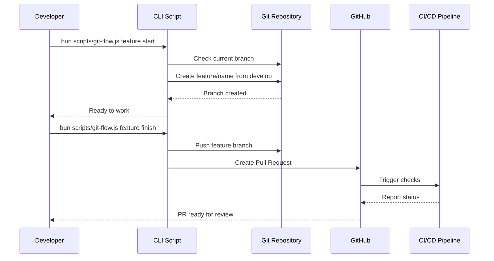

# Design Document: Git Workflow Setup

## Overview

This design implements a comprehensive Gitflow workflow for the CouchCMS AI Toolkit, providing automated branch management, pull request workflows, and quality gates. The system consists of automation scripts, GitHub Actions workflows, documentation, and branch protection configurations that work together to enforce best practices and maintain code quality.

The design focuses on simplicity and developer experience, providing CLI scripts that abstract away Git complexity while maintaining full transparency. All automation is built using Bun/Node.js to align with the existing toolkit architecture.

## Architecture

### High-Level Architecture

```
┌─────────────────────────────────────────────────────────────┐
│                     Developer Interface                      │
│  (CLI Scripts: git-flow.js, create-pr.js, check-branch.js) │
└────────────────┬────────────────────────────────────────────┘
                 │
                 ▼
┌─────────────────────────────────────────────────────────────┐
│                    Git Operations Layer                      │
│         (Branch Management, Merge Operations, Tags)          │
└────────────────┬────────────────────────────────────────────┘
                 │
                 ▼
┌─────────────────────────────────────────────────────────────┐
│                   GitHub Integration                         │
│        (Branch Protection, PR Templates, Actions)            │
└─────────────────────────────────────────────────────────────┘
```

### Component Interaction Flow



## Components and Interfaces

### 1. CLI Scripts (`scripts/git-flow.js`)

Main entry point for all Gitflow operations.

**Interface:**
```javascript
// Command structure
bun scripts/git-flow.js <type> <action> [options]

// Types: feature, release, hotfix
// Actions: start, finish, list, delete
// Options: --name, --version, --base, --force
```

**Responsibilities:**
- Parse command-line arguments
- Validate branch names and states
- Execute Git operations
- Provide user feedback and error handling
- Integrate with GitHub API for PR creation

**Key Functions:**
```javascript
async function startFeature(name, options)
async function finishFeature(name, options)
async function startRelease(version, options)
async function finishRelease(version, options)
async function startHotfix(name, options)
async function finishHotfix(name, options)
async function listBranches(type)
async function checkStaleBranches(days = 30)
```

### 2. Pull Request Automation (`scripts/create-pr.js`)

Handles PR creation with templates and automation.

**Interface:**
```javascript
async function createPullRequest(options: {
    source: string,      // Source branch
    target: string,      // Target branch (develop/main)
    title: string,       // PR title
    type: string,        // feature/release/hotfix
    description?: string // Optional description
}): Promise<PRResult>
```

**Responsibilities:**
- Generate PR descriptions from commit history
- Apply appropriate PR templates
- Set labels and assignees
- Link related issues
- Trigger CI/CD pipelines

### 3. Branch Validation (`scripts/check-branch.js`)

Validates branch states and naming conventions.

**Interface:**
```javascript
async function validateBranch(branchName: string): Promise<ValidationResult>
async function checkBranchAge(branchName: string): Promise<number>
async function findStaleBranches(maxAge: number): Promise<string[]>
```

**Responsibilities:**
- Verify branch naming conventions
- Check branch age and activity
- Detect merge conflicts
- Validate branch relationships (parent/child)

### 4. GitHub Actions Workflows

**`.github/workflows/pr-checks.yml`**
- Runs on all pull requests
- Executes linting, tests, and validation
- Reports status back to PR

**`.github/workflows/release.yml`**
- Triggers on release branch merges to main
- Creates GitHub releases
- Generates changelogs
- Tags versions

### 5. Configuration Files

**`.github/PULL_REQUEST_TEMPLATE.md`**
- Standard PR template with checklist
- Sections for description, testing, breaking changes

**`.github/branch-protection.json`**
- Branch protection rules configuration
- Applied via GitHub API or manual setup

## Data Models

### Branch Information
```typescript
interface BranchInfo {
    name: string
    type: 'feature' | 'release' | 'hotfix' | 'develop' | 'main'
    createdAt: Date
    lastCommit: Date
    author: string
    parent: string
    status: 'active' | 'stale' | 'merged'
}
```

### Pull Request Data
```typescript
interface PullRequestData {
    title: string
    body: string
    source: string
    target: string
    labels: string[]
    assignees: string[]
    reviewers: string[]
    draft: boolean
}
```

### Validation Result
```typescript
interface ValidationResult {
    valid: boolean
    errors: string[]
    warnings: string[]
    branchInfo: BranchInfo
}
```

### Workflow State
```typescript
interface WorkflowState {
    currentBranch: string
    hasUncommittedChanges: boolean
    isClean: boolean
    remoteBranches: string[]
    staleBranches: BranchInfo[]
}
```


## Correctness Properties

*A property is a characteristic or behavior that should hold true across all valid executions of a system-essentially, a formal statement about what the system should do. Properties serve as the bridge between human-readable specifications and machine-verifiable correctness guarantees.*

### Property 1: Main branch merges only from approved sources
*For any* merge to the main branch, the merge source must be either the develop branch, a release branch, or a hotfix branch.
**Validates: Requirements 1.3**

### Property 2: Protected branches reject direct commits
*For any* attempt to push commits directly to main or develop branches (when protection is enabled), the push must be rejected.
**Validates: Requirements 1.5**

### Property 3: Feature branches follow naming convention and parent
*For any* feature branch created by the git-flow script, the branch name must match the pattern `feature/*` and must be created from the develop branch.
**Validates: Requirements 2.1**

### Property 4: Feature finish creates PR to develop
*For any* feature branch when finished, the system must create a pull request targeting the develop branch.
**Validates: Requirements 2.2**

### Property 5: Merged feature branches are deleted
*For any* feature branch that has been successfully merged, the branch must be deleted from both local and remote repositories.
**Validates: Requirements 2.3**

### Property 6: Stale branch detection
*For any* branch older than a specified threshold (default 30 days), the check-branch script must flag it as stale.
**Validates: Requirements 2.5**

### Property 7: Release branches follow naming convention and parent
*For any* release branch created by the git-flow script, the branch name must match the pattern `release/*` and must be created from the develop branch.
**Validates: Requirements 3.1**

### Property 8: Release finish merges to both main and develop
*For any* release branch when finished, the system must create merges (or PRs) to both the main branch and the develop branch.
**Validates: Requirements 3.3**

### Property 9: Release merges create version tags
*For any* release branch merged to main, the system must create a Git tag with the release version number.
**Validates: Requirements 3.4**

### Property 10: Merged release branches are deleted
*For any* release branch that has been successfully merged, the branch must be deleted from both local and remote repositories.
**Validates: Requirements 3.5**

### Property 11: Hotfix branches follow naming convention and parent
*For any* hotfix branch created by the git-flow script, the branch name must match the pattern `hotfix/*` and must be created from the main branch.
**Validates: Requirements 4.1**

### Property 12: Hotfix finish merges to main and develop
*For any* hotfix branch when finished, the system must create merges (or PRs) to both the main branch and the develop branch.
**Validates: Requirements 4.2**

### Property 13: Hotfix merges create patch version tags
*For any* hotfix branch merged to main, the system must create a Git tag with an incremented patch version.
**Validates: Requirements 4.3**

### Property 14: Merged hotfix branches are deleted
*For any* hotfix branch that has been successfully merged, the branch must be deleted from both local and remote repositories.
**Validates: Requirements 4.4**

### Property 15: Hotfix merges to release branch when present
*For any* hotfix branch when finished, if a release branch exists, the system must also merge the hotfix into the release branch.
**Validates: Requirements 4.5**

### Property 16: Force push prevention on protected branches
*For any* attempt to force push to main or develop branches (when protection is enabled), the push must be rejected.
**Validates: Requirements 5.4**

### Property 17: PR templates are applied
*For any* pull request created by the create-pr script, the PR body must contain the standard template sections (description, testing, checklist).
**Validates: Requirements 6.2**

### Property 18: PR merge conflicts are detected
*For any* pull request with conflicting changes, the system must mark the PR as having merge conflicts and prevent merging.
**Validates: Requirements 7.3**

### Property 19: Branch listing completeness
*For any* set of branches in the repository, the list command must display all branches of the requested type with their metadata.
**Validates: Requirements 8.1**

### Property 20: Branch listing includes commit dates
*For any* branch displayed by the list command, the output must include the last commit date for that branch.
**Validates: Requirements 8.2**

### Property 21: Changelog generation between releases
*For any* two release tags, the system must be able to generate a changelog containing all commits between those releases.
**Validates: Requirements 8.4, 8.5**

## Error Handling

### Git Operation Failures

**Scenario:** Git commands fail (network issues, conflicts, permissions)

**Handling:**
- Catch all Git command errors with try-catch blocks
- Provide clear error messages with context
- Suggest remediation steps (e.g., "Run `git pull` to sync with remote")
- Never leave repository in inconsistent state
- Rollback partial operations when possible

**Example:**
```javascript
try {
    await $`git checkout -b ${branchName}`;
} catch (error) {
    throw new ToolkitError(
        `Failed to create branch '${branchName}'. ${error.message}`,
        'GIT_CHECKOUT_FAILED',
        error
    );
}
```

### Branch Name Validation

**Scenario:** Invalid branch names provided by user

**Handling:**
- Validate branch names against patterns before Git operations
- Reject names with invalid characters (spaces, special chars)
- Provide examples of valid names
- Suggest corrections for common mistakes

**Validation Rules:**
- Feature: `feature/[a-z0-9-]+`
- Release: `release/v?\d+\.\d+\.\d+`
- Hotfix: `hotfix/[a-z0-9-]+`

### Merge Conflicts

**Scenario:** Automatic merge fails due to conflicts

**Handling:**
- Detect conflicts before attempting merge when possible
- Provide clear conflict resolution instructions
- Link to documentation on conflict resolution
- Offer to abort the operation
- Never force merge with conflicts

### Stale Branch Detection

**Scenario:** Branch hasn't been updated in 30+ days

**Handling:**
- Warn user but don't block operations
- Suggest rebasing from parent branch
- Provide option to delete if no longer needed
- Log stale branches for team review

### GitHub API Failures

**Scenario:** GitHub API calls fail (rate limits, auth issues, network)

**Handling:**
- Check for GitHub CLI (`gh`) availability before API calls
- Provide fallback instructions for manual PR creation
- Cache API responses when appropriate
- Respect rate limits with exponential backoff
- Clear error messages for authentication issues

### Uncommitted Changes

**Scenario:** User has uncommitted changes when switching branches

**Handling:**
- Check for uncommitted changes before branch operations
- Warn user and suggest stashing or committing
- Provide `--force` flag to override (with warning)
- Never lose user's work

### Missing Parent Branch

**Scenario:** Parent branch (develop/main) doesn't exist

**Handling:**
- Verify parent branch exists before creating child branches
- Offer to create parent branch if missing
- Provide clear error message with setup instructions
- Link to initialization documentation

## Testing Strategy

### Unit Testing

Unit tests will verify individual functions and components in isolation:

**Branch Validation Tests:**
- Test branch name pattern matching for feature/release/hotfix
- Test invalid branch name rejection
- Test branch age calculation
- Test stale branch detection logic

**Git Command Wrapper Tests:**
- Test command construction with various parameters
- Test error handling for failed commands
- Test output parsing from Git commands

**PR Template Tests:**
- Test template loading and variable substitution
- Test template section detection
- Test PR body generation from commits

**Utility Function Tests:**
- Test version number parsing and incrementing
- Test date calculations for branch age
- Test branch type detection from name

### Property-Based Testing

Property-based tests will verify correctness properties across many randomly generated inputs:

**Testing Framework:** We will use `fast-check` for JavaScript/TypeScript property-based testing.

**Configuration:** Each property test will run a minimum of 100 iterations to ensure thorough coverage.

**Test Organization:** Each correctness property will be implemented as a separate property-based test, tagged with the property number and requirement reference.

**Property Test Coverage:**
- Branch naming conventions (Properties 3, 7, 11)
- Branch parent relationships (Properties 1, 3, 7, 11)
- Merge target validation (Properties 4, 8, 12, 15)
- Tag creation (Properties 9, 13)
- Branch cleanup (Properties 5, 10, 14)
- Stale branch detection (Property 6)
- Template application (Property 17)
- List completeness (Properties 19, 20)

**Example Property Test Structure:**
```javascript
import fc from 'fast-check';

// Feature: git-workflow-setup, Property 3: Feature branches follow naming convention and parent
test('Property 3: Feature branches created from develop with correct naming', () => {
    fc.assert(
        fc.property(
            fc.string({ minLength: 3, maxLength: 50 })
              .filter(s => /^[a-z0-9-]+$/.test(s)),
            async (featureName) => {
                const branchName = await createFeatureBranch(featureName);
                expect(branchName).toMatch(/^feature\//);
                const parent = await getBranchParent(branchName);
                expect(parent).toBe('develop');
            }
        ),
        { numRuns: 100 }
    );
});
```

### Integration Testing

Integration tests will verify the complete workflows:

**Feature Workflow Test:**
1. Start feature from develop
2. Make commits
3. Finish feature (create PR)
4. Verify PR targets develop
5. Verify branch cleanup after merge

**Release Workflow Test:**
1. Start release from develop
2. Finish release
3. Verify merges to main and develop
4. Verify tag creation
5. Verify branch cleanup

**Hotfix Workflow Test:**
1. Start hotfix from main
2. Finish hotfix
3. Verify merges to main and develop
4. Verify patch tag creation
5. Verify branch cleanup

### GitHub Actions Testing

**PR Checks Workflow:**
- Verify workflow triggers on PR events
- Verify linting step executes
- Verify test step executes
- Verify status reporting to PR

**Release Workflow:**
- Verify workflow triggers on main branch merges
- Verify tag creation
- Verify GitHub release creation
- Verify changelog generation

### Manual Testing Checklist

- [ ] Create feature branch and verify naming
- [ ] Create PR from feature and verify template
- [ ] Merge feature and verify cleanup
- [ ] Create release branch and verify workflow
- [ ] Create hotfix and verify multi-branch merge
- [ ] Test stale branch detection
- [ ] Test branch protection enforcement
- [ ] Test with uncommitted changes
- [ ] Test with merge conflicts
- [ ] Test GitHub API integration

## Implementation Notes

### Technology Choices

**Bun Shell (`$` template):** Use Bun's built-in shell for Git commands
- Simpler than child_process
- Better error handling
- Consistent with existing toolkit scripts

**GitHub CLI (`gh`):** Use for GitHub API operations
- Handles authentication automatically
- Simpler than REST API
- Widely available on developer machines

**fast-check:** Property-based testing library
- Mature and well-maintained
- Good TypeScript support
- Integrates with standard test runners

### Script Organization

```
scripts/
├── git-flow.js           # Main CLI entry point
├── git-flow/
│   ├── feature.js        # Feature branch operations
│   ├── release.js        # Release branch operations
│   ├── hotfix.js         # Hotfix branch operations
│   ├── validation.js     # Branch validation logic
│   ├── git-wrapper.js    # Git command wrappers
│   └── github.js         # GitHub API integration
└── utils.js              # Shared utilities (existing)
```

### Configuration

Store workflow configuration in `defaults.yaml`:

```yaml
gitflow:
  branches:
    main: main
    develop: develop
  patterns:
    feature: feature/
    release: release/
    hotfix: hotfix/
  stale_days: 30
  auto_delete: true
  require_pr: true
```

### Documentation Structure

```
docs/
├── GIT-WORKFLOW.md       # Main workflow documentation
├── git-workflow/
│   ├── getting-started.md
│   ├── feature-workflow.md
│   ├── release-workflow.md
│   ├── hotfix-workflow.md
│   ├── troubleshooting.md
│   └── diagrams/
│       └── gitflow.mermaid
```

### GitHub Configuration

**Branch Protection (via GitHub UI or API):**
- Require pull request reviews (1 approval)
- Require status checks to pass
- Require branches to be up to date
- Restrict force pushes
- Restrict deletions

**PR Template Location:**
`.github/PULL_REQUEST_TEMPLATE.md`

**Workflow Files:**
- `.github/workflows/pr-checks.yml`
- `.github/workflows/release.yml`

### Backward Compatibility

- Scripts should detect if repository is already using Gitflow
- Provide migration guide for existing projects
- Support both `master` and `main` as production branch names
- Allow customization of branch names via configuration

### Security Considerations

- Never store GitHub tokens in scripts or config files
- Use GitHub CLI for authentication (delegates to user's credentials)
- Validate all user input to prevent command injection
- Audit log for branch protection bypasses
- Require signed commits (optional, configurable)

### Performance Considerations

- Cache Git command results when appropriate
- Minimize GitHub API calls (use CLI caching)
- Batch operations when possible
- Provide `--quiet` flag for CI/CD usage
- Async operations for parallel Git commands
