# Design Document: Toolkit Simplification

## Overview

This design implements a comprehensive simplification of the CouchCMS AI Toolkit by consolidating configuration files, refactoring monolithic scripts into modular components, removing support for rarely-used editors, and streamlining smart defaults. The refactoring maintains backward compatibility while significantly reducing complexity and improving performance.

The design focuses on three core principles:
1. **Simplicity** - Reduce cognitive load by consolidating files and removing unused features
2. **Modularity** - Break large scripts into small, testable, single-responsibility modules
3. **Performance** - Optimize sync process to be 50% faster through caching and selective generation

## Architecture

### High-Level Architecture

```
┌─────────────────────────────────────────────────────────────┐
│                    User Interface (CLI)                      │
│              init.js, sync.js, validate.js                   │
└────────────────┬────────────────────────────────────────────┘
                 │
                 ▼
┌─────────────────────────────────────────────────────────────┐
│                   Core Library (scripts/lib/)                │
│  config-loader │ module-loader │ template-engine │ writer   │
└────────────────┬────────────────────────────────────────────┘
                 │
                 ▼
┌─────────────────────────────────────────────────────────────┐
│                  Configuration Layer                         │
│            config.yaml (consolidated config)                 │
└────────────────┬────────────────────────────────────────────┘
                 │
                 ▼
┌─────────────────────────────────────────────────────────────┐
│                    Data Layer                                │
│         Modules, Agents, Templates, Framework                │
└─────────────────────────────────────────────────────────────┘
```

### Component Interaction Flow

```mermaid
sequenceDiagram
    participant User
    participant CLI as CLI Script
    participant Loader as Config Loader
    participant ModLoader as Module Loader
    participant Engine as Template Engine
    participant Writer as File Writer

    User->>CLI: bun run sync
    CLI->>Loader: loadConfig()
    Loader-->>CLI: config object
    CLI->>ModLoader: loadModules(config.modules)
    ModLoader-->>CLI: module data
    CLI->>Engine: renderTemplates(data, editors)
    Engine-->>CLI: rendered configs
    CLI->>Writer: writeConfigs(configs)
    Writer-->>CLI: success
    CLI-->>User: ✅ Sync complete
```



## Components and Interfaces

### 1. Configuration Consolidation

**New Structure:**
```yaml
# config.yaml (replaces defaults.yaml + smart-defaults.yaml + preflight-checks.yaml)

# Project settings
project:
  name: "my-project"
  description: "Project description"
  type: "CouchCMS Web Application"

# Toolkit location
toolkit:
  path: "./ai-toolkit-shared"

# Editors to generate configs for
editors:
  - cursor
  - claude
  - windsurf
  - kiro
  - copilot

# Modules to load
modules:
  - couchcms-core
  - tailwindcss
  - alpinejs

# Agents to load
agents:
  - couchcms
  - tailwindcss
  - alpinejs

# Framework configuration
framework:
  enabled: false
  # OR: { doctrine: true, directives: true, playbooks: true }

# Project paths
paths:
  css: "assets/css"
  typescript: "assets/ts"
  javascript: "assets/js"
  components: "snippets/components"
  views: "snippets/views"
  layouts: "snippets/layouts"
  filters: "snippets/filters"
  forms: "snippets/forms"
  public: "public"

# Coding standards
standards:
  indentation: 4
  language: "english"
  lineLength: 120

# Naming conventions
naming:
  php_variables: "snake_case"
  php_functions: "snake_case"
  cms_fields: "snake_case"
  ts_variables: "camelCase"
  ts_functions: "camelCase"
  ts_classes: "PascalCase"
  css_classes: "kebab-case"

# File contexts (auto-load modules based on file type)
file_contexts:
  "*.php":
    agents: [couchcms]
    modules: [couchcms-core]
  "*.ts":
    agents: [typescript]
    modules: [typescript]
  "snippets/components/*.html":
    agents: [couchcms, alpinejs]
    modules: [couchcms-core, alpinejs]

# Template aliases
template_aliases:
  component-basic: "templates/components/basic.html"
  view-list: "templates/views/list.html"
  form-basic: "templates/forms/basic.html"

# Validation rules
validation:
  required_modules: [couchcms-core]
  max_line_length: 200
  enforce_english: true
```

**Migration Strategy:**
- Keep `standards.md` as primary config (backward compatible)
- Merge defaults.yaml, smart-defaults.yaml, preflight-checks.yaml into config.yaml
- Support both old and new formats during transition
- Provide migration script to convert old → new

### 2. Modular Script Architecture

**scripts/lib/config-loader.js**
```javascript
/**
 * Load and merge configuration from all sources
 * @param {string} projectDir - Project root directory
 * @param {string} toolkitPath - Toolkit root directory
 * @returns {object} - Merged configuration object
 */
export function loadConfig(projectDir, toolkitPath) {
    // 1. Load toolkit defaults (config.yaml)
    // 2. Load project config (standards.md or config.yaml)
    // 3. Deep merge with project overrides
    // 4. Validate required fields
    // 5. Return merged config
}

/**
 * Validate configuration structure and values
 * @param {object} config - Configuration object
 * @returns {Array<string>} - Array of validation errors (empty if valid)
 */
export function validateConfig(config) {
    // Check required fields
    // Validate paths exist
    // Validate module names
    // Validate editor names
}
```

**scripts/lib/module-loader.js**
```javascript
/**
 * Load modules from toolkit
 * @param {Array<string>} moduleNames - Module names to load
 * @param {string} toolkitPath - Toolkit root directory
 * @returns {Array<object>} - Array of loaded modules with {name, meta, content}
 */
export function loadModules(moduleNames, toolkitPath) {
    // Load each module .md file
    // Parse frontmatter
    // Check for conflicts
    // Return module objects
}

/**
 * Load agents from toolkit
 * @param {Array<string>} agentNames - Agent names to load
 * @param {string} toolkitPath - Toolkit root directory
 * @returns {Array<object>} - Array of loaded agents
 */
export function loadAgents(agentNames, toolkitPath) {
    // Similar to loadModules
}

/**
 * Load framework components
 * @param {object} frameworkConfig - Framework configuration
 * @param {string} toolkitPath - Toolkit root directory
 * @returns {object|null} - Framework content or null if disabled
 */
export function loadFramework(frameworkConfig, toolkitPath) {
    // Load doctrine, directives, playbooks, enhancements
    // Based on config
}
```

**scripts/lib/template-engine.js**
```javascript
/**
 * Prepare template data from config and loaded modules
 * @param {object} config - Configuration object
 * @param {Array<object>} modules - Loaded modules
 * @param {Array<object>} agents - Loaded agents
 * @param {object} framework - Framework content
 * @returns {object} - Template data for Handlebars
 */
export function prepareTemplateData(config, modules, agents, framework) {
    // Build template data object
    // Extract languages, frameworks
    // Build tech hierarchy
    // Return data for rendering
}

/**
 * Render templates for specified editors
 * @param {object} templateData - Data for template rendering
 * @param {Array<string>} editors - Editor names to generate for
 * @param {string} toolkitPath - Toolkit root directory
 * @returns {Map<string, string>} - Map of output path → rendered content
 */
export function renderTemplates(templateData, editors, toolkitPath) {
    // For each editor in list
    // Load template file
    // Render with Handlebars
    // Return map of outputs
}
```

**scripts/lib/file-writer.js**
```javascript
/**
 * Write generated configs to disk
 * @param {Map<string, string>} configs - Map of path → content
 * @param {string} projectDir - Project root directory
 * @returns {number} - Number of files written
 */
export function writeConfigs(configs, projectDir) {
    // For each config
    // Check if content changed (skip if identical)
    // Create directories if needed
    // Write file
    // Return count
}

/**
 * Check if file content has changed
 * @param {string} filePath - Path to file
 * @param {string} newContent - New content to write
 * @returns {boolean} - True if content is different
 */
export function hasChanged(filePath, newContent) {
    // Read existing file
    // Compare content
    // Return true if different
}
```

**scripts/lib/cache.js**
```javascript
/**
 * Simple in-memory cache for parsed modules
 */
export class ModuleCache {
    constructor() {
        this.cache = new Map()
    }

    get(key) {
        return this.cache.get(key)
    }

    set(key, value) {
        this.cache.set(key, value)
    }

    has(key) {
        return this.cache.has(key)
    }

    clear() {
        this.cache.clear()
    }
}
```

### 3. Refactored sync.js

**New Structure (< 200 lines):**
```javascript
#!/usr/bin/env bun
import { loadConfig, validateConfig } from './lib/config-loader.js'
import { loadModules, loadAgents, loadFramework } from './lib/module-loader.js'
import { prepareTemplateData, renderTemplates } from './lib/template-engine.js'
import { writeConfigs } from './lib/file-writer.js'
import { handleError } from './utils.js'

async function sync() {
    console.log('🔄 CouchCMS AI Toolkit - Sync\n')
    
    const startTime = Date.now()
    
    try {
        // 1. Load configuration
        const config = loadConfig(projectDir, toolkitPath)
        const errors = validateConfig(config)
        if (errors.length > 0) {
            throw new Error(`Invalid configuration:\n${errors.join('\n')}`)
        }
        
        // 2. Load modules, agents, framework
        const modules = loadModules(config.modules, toolkitPath)
        const agents = loadAgents(config.agents || [], toolkitPath)
        const framework = loadFramework(config.framework, toolkitPath)
        
        // 3. Prepare template data
        const templateData = prepareTemplateData(config, modules, agents, framework)
        
        // 4. Render templates for enabled editors
        const editors = config.editors || ['cursor', 'claude', 'windsurf', 'kiro', 'copilot']
        const renderedConfigs = renderTemplates(templateData, editors, toolkitPath)
        
        // 5. Write configs to disk
        const writtenCount = writeConfigs(renderedConfigs, projectDir)
        
        const elapsed = Date.now() - startTime
        console.log(`\n✅ Sync complete! Generated ${writtenCount} files in ${elapsed}ms\n`)
        
    } catch (error) {
        handleError(error)
        process.exit(1)
    }
}

sync()
```

### 4. Refactored init.js

**New Structure (< 300 lines):**
```javascript
#!/usr/bin/env bun
import { prompt, confirm } from './lib/prompts.js'
import { generateConfig } from './lib/config-generator.js'
import { runSync } from './lib/sync-runner.js'

async function init() {
    console.log('🚀 CouchCMS AI Toolkit - Setup\n')
    
    // 1. Check for existing config
    const hasExisting = checkExistingConfig()
    if (hasExisting && !await confirm('Overwrite existing config?', false)) {
        process.exit(0)
    }
    
    // 2. Ask for setup mode
    const mode = await prompt('Setup mode? [1=Simple, 2=Custom]', '1')
    const isSimple = mode === '1'
    
    // 3. Gather project info
    const projectName = await prompt('Project name', 'my-project')
    const projectDescription = await prompt('Description', 'My CouchCMS project')
    
    // 4. Select modules and agents (simple = defaults, custom = ask)
    const modules = isSimple 
        ? ['couchcms-core', 'tailwindcss', 'alpinejs']
        : await selectModules()
    
    const agents = isSimple
        ? ['couchcms', 'tailwindcss', 'alpinejs']
        : await selectAgents()
    
    // 5. Generate config file
    const configPath = await generateConfig({
        projectName,
        projectDescription,
        modules,
        agents,
        isSimple
    })
    
    console.log(`\n✅ Created: ${configPath}`)
    
    // 6. Run initial sync
    if (await confirm('Run sync now?', true)) {
        await runSync()
    }
    
    console.log('\n✨ Setup complete!\n')
}

init()
```

### 5. Editor Support Changes

**Removed Editors:**
- Tabnine
- CodeWhisperer

**Kept Editors:**
- Cursor (.cursorrules)
- Claude Code (.claude/)
- Windsurf (.windsurf/rules.md)
- Kiro (.kiro/steering/)
- GitHub Copilot (.github/copilot-instructions.md)

**Template Mapping:**
```javascript
const EDITOR_TEMPLATES = {
    cursor: {
        template: 'cursor.template.md',
        output: '.cursorrules'
    },
    claude: {
        template: 'claude.template.md',
        output: 'CLAUDE.md',
        additional: [
            { template: 'claude-skills.json', output: '.claude/skills/skill-rules.json' },
            { template: 'claude-settings.json', output: '.claude/settings.json' }
        ]
    },
    windsurf: {
        template: 'windsurf.template.md',
        output: '.windsurf/rules.md'
    },
    kiro: {
        template: 'kiro.template.md',
        output: '.kiro/steering/coding-standards.md'
    },
    copilot: {
        template: 'copilot.template.md',
        output: '.github/copilot-instructions.md'
    }
}
```

### 6. Simplified Smart Defaults

**New smart-defaults.yaml (70% smaller):**
```yaml
# File contexts - auto-load modules based on file type
file_contexts:
  "*.php":
    agents: [couchcms]
    modules: [couchcms-core]
    
  "*.ts":
    agents: [typescript]
    modules: [typescript]
    
  "*.js":
    agents: [typescript]
    modules: [typescript]
    
  "snippets/components/*.html":
    agents: [couchcms, alpinejs]
    modules: [couchcms-core, alpinejs]
    
  "snippets/views/**/*.html":
    agents: [couchcms]
    modules: [couchcms-core]
    
  "snippets/forms/*.html":
    agents: [databound-forms, couchcms]
    modules: [databound-forms, couchcms-core]

# Template aliases
template_aliases:
  component-basic: "templates/components/basic.html"
  component-alpine: "templates/components/alpine.html"
  view-list: "templates/views/list.html"
  view-detail: "templates/views/detail.html"
  form-basic: "templates/forms/basic.html"
  filter-basic: "templates/filters/basic.html"

# Removed sections:
# - action_contexts (not used)
# - intent_patterns (AI editors handle this)
# - communication_modes (not used)
# - suggestion_triggers (too complex)
# - context_cache_schema (over-engineering)
```

## Data Models

### Configuration Object
```typescript
interface Config {
    project: {
        name: string
        description: string
        type: string
    }
    toolkit: {
        path: string
    }
    editors: string[]  // ['cursor', 'claude', 'windsurf', 'kiro', 'copilot']
    modules: string[]
    agents: string[]
    framework: boolean | {
        doctrine?: boolean
        directives?: boolean
        playbooks?: boolean
        enhancements?: boolean
    }
    paths: {
        [key: string]: string
    }
    standards: {
        indentation: number
        language: string
        lineLength: number
    }
    naming: {
        [key: string]: string
    }
    file_contexts?: {
        [pattern: string]: {
            agents: string[]
            modules: string[]
        }
    }
}
```

### Module Object
```typescript
interface Module {
    name: string
    meta: {
        name?: string
        description?: string
        version?: string
        category?: string
        requires?: string[]
        conflicts?: string[]
    }
    content: string
}
```

### Template Data Object
```typescript
interface TemplateData {
    project: {
        name: string
        type: string
        description: string
    }
    standards: {
        indentation: number
        line_length: number
        language: string
        naming: object
    }
    paths: object
    languages: string[]
    frameworks: string[]
    tech_hierarchy: Array<{
        name: string
        description: string
        order: number
    }>
    modules: Array<{
        name: string
        description: string
        version: string
        slug: string
    }>
    agents: Array<{
        name: string
        description: string
        type: string
    }>
    framework: string
    framework_enabled: boolean
    timestamp: string
}
```

## Error Handling

### Configuration Errors

**Scenario:** Invalid or missing configuration

**Handling:**
- Validate config structure before processing
- Provide specific error messages (e.g., "Missing required field: project.name")
- Suggest corrections (e.g., "Did you mean 'couchcms-core' instead of 'couchcms'?")
- Exit gracefully with error code 1

### Module Loading Errors

**Scenario:** Module file not found or invalid

**Handling:**
- Warn about missing modules but continue
- List available modules if module not found
- Skip invalid modules and log warning
- Continue sync with available modules

### Template Rendering Errors

**Scenario:** Template syntax error or missing variable

**Handling:**
- Catch Handlebars errors
- Show template name and line number
- Display problematic template section
- Provide template data for debugging
- Exit with clear error message

### File Writing Errors

**Scenario:** Permission denied or disk full

**Handling:**
- Catch file system errors
- Show which file failed to write
- Suggest solutions (check permissions, disk space)
- Continue writing other files if possible
- Report partial success

### Migration Errors

**Scenario:** Cannot migrate old config to new format

**Handling:**
- Backup old config before migration
- Validate migrated config
- If validation fails, restore backup
- Provide manual migration guide
- Log detailed error information

## Testing Strategy

### Unit Testing

Unit tests will verify individual functions in isolation:

**Config Loader Tests:**
- Test loading config from standards.md
- Test loading config from config.yaml
- Test merging defaults with project config
- Test validation of required fields
- Test validation of module names
- Test validation of editor names

**Module Loader Tests:**
- Test loading single module
- Test loading multiple modules
- Test handling missing modules
- Test detecting module conflicts
- Test loading agents
- Test loading framework components

**Template Engine Tests:**
- Test preparing template data
- Test rendering single template
- Test rendering multiple templates
- Test handling missing variables
- Test Handlebars helper functions

**File Writer Tests:**
- Test writing single file
- Test writing multiple files
- Test skipping unchanged files
- Test creating directories
- Test handling write errors

### Property-Based Testing

Property-based tests will verify correctness across many inputs:

**Testing Framework:** fast-check

**Configuration:** 100 iterations per test

**Test Organization:** Each property as separate test with requirement reference

### Integration Testing

Integration tests will verify complete workflows:

**Sync Workflow Test:**
1. Create test project with config
2. Run sync
3. Verify all editor configs generated
4. Verify content matches expected output
5. Verify file permissions correct

**Init Workflow Test:**
1. Run init in empty directory
2. Answer prompts programmatically
3. Verify config file created
4. Verify sync runs successfully
5. Verify all files generated

**Migration Workflow Test:**
1. Create project with old config format
2. Run migration
3. Verify new config created
4. Verify old config backed up
5. Verify sync works with new config

### Performance Testing

**Sync Performance Test:**
- Measure sync time before refactoring
- Measure sync time after refactoring
- Verify 50% improvement
- Test with various project sizes
- Profile bottlenecks

**Cache Effectiveness Test:**
- Measure sync time with cold cache
- Measure sync time with warm cache
- Verify cache hit rate > 80%
- Test cache invalidation

## Implementation Notes

### Migration Strategy

**Phase 1: Add New Structure (Backward Compatible)**
- Add config.yaml support alongside existing files
- Add new lib/ modules
- Keep old code paths working
- Add deprecation warnings

**Phase 2: Migrate Users**
- Provide migration script
- Update documentation
- Announce deprecation timeline
- Support both formats for 2 releases

**Phase 3: Remove Old Structure**
- Remove old config file support
- Remove deprecated code
- Clean up documentation
- Celebrate simplification 🎉

### Performance Optimizations

**Module Caching:**
```javascript
const moduleCache = new ModuleCache()

function loadModule(name, toolkitPath) {
    const cacheKey = `${toolkitPath}:${name}`
    
    if (moduleCache.has(cacheKey)) {
        return moduleCache.get(cacheKey)
    }
    
    const module = parseModuleFile(name, toolkitPath)
    moduleCache.set(cacheKey, module)
    return module
}
```

**Selective File Writing:**
```javascript
function writeIfChanged(filePath, newContent) {
    if (!existsSync(filePath)) {
        writeFileSync(filePath, newContent)
        return true
    }
    
    const oldContent = readFileSync(filePath, 'utf8')
    if (oldContent === newContent) {
        return false // Skip, unchanged
    }
    
    writeFileSync(filePath, newContent)
    return true
}
```

**Parallel Template Rendering:**
```javascript
async function renderTemplates(templateData, editors, toolkitPath) {
    const promises = editors.map(editor => 
        renderEditorTemplate(editor, templateData, toolkitPath)
    )
    
    const results = await Promise.all(promises)
    return new Map(results)
}
```

### Backward Compatibility

**Support Old Config Format:**
```javascript
function loadConfig(projectDir, toolkitPath) {
    // Try new format first
    const newConfig = tryLoadConfigYaml(projectDir)
    if (newConfig) {
        return newConfig
    }
    
    // Fall back to old format
    const oldConfig = loadLegacyConfig(projectDir, toolkitPath)
    
    // Warn about deprecation
    console.warn('⚠️  Using legacy config format. Run migration: bun run migrate')
    
    return oldConfig
}
```

**Migration Script:**
```javascript
// scripts/migrate.js
async function migrate() {
    // 1. Detect old config files
    // 2. Parse and merge them
    // 3. Generate new config.yaml
    // 4. Backup old files
    // 5. Validate new config
    // 6. Run sync to test
}
```

### Documentation Updates

**Files to Update:**
- README.md - Remove Tabnine/CodeWhisperer references
- GETTING-STARTED.md - Update setup instructions
- CONFIG-FILES.md - Document new config.yaml structure
- TROUBLESHOOTING.md - Add migration troubleshooting
- CHANGELOG.md - Document breaking changes
- MIGRATION.md - New file with upgrade guide

### Code Organization

**New Directory Structure:**
```
scripts/
├── init.js                    # < 300 lines
├── sync.js                    # < 200 lines
├── validate.js                # < 200 lines (unchanged)
├── migrate.js                 # < 200 lines (new)
├── utils.js                   # Shared utilities
└── lib/
    ├── config-loader.js       # < 300 lines
    ├── module-loader.js       # < 300 lines
    ├── template-engine.js     # < 300 lines
    ├── file-writer.js         # < 200 lines
    ├── cache.js               # < 100 lines
    ├── prompts.js             # < 150 lines
    ├── config-generator.js    # < 200 lines
    └── sync-runner.js         # < 100 lines
```

### Testing Infrastructure

**Test Directory Structure:**
```
tests/
├── unit/
│   ├── config-loader.test.js
│   ├── module-loader.test.js
│   ├── template-engine.test.js
│   └── file-writer.test.js
├── integration/
│   ├── sync-workflow.test.js
│   ├── init-workflow.test.js
│   └── migration-workflow.test.js
├── property/
│   ├── config-validation.property.test.js
│   ├── module-loading.property.test.js
│   └── template-rendering.property.test.js
├── performance/
│   └── sync-performance.test.js
└── fixtures/
    ├── configs/
    ├── modules/
    └── templates/
```
