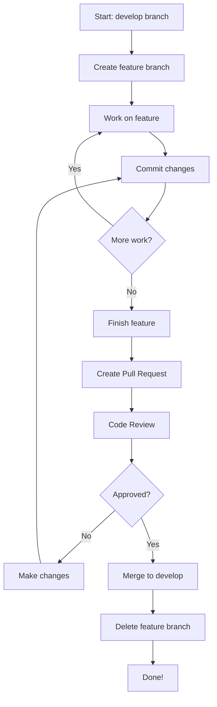

# Git Workflow - Collaborating on CouchCMS AI Toolkit

> **For everyone:** This guide is written for both beginners and experienced developers. You don't need to be a Git expert!

## 📖 What is this?

This is a **simple system** for collaborating on code without chaos. Think of it as traffic rules for code:
- Everyone knows where to work
- Nobody gets in each other's way
- Code is reviewed before going live
- Everything stays organized

## 🎯 The Basics in 30 Seconds

```text
main (production)    ──●────────●────────●──────→  Stable code, live
                        ↑        ↑        ↑
develop (integration)──●──●──●──●──●──●──●──●──→  New features come together here
                        ↑  ↑  ↑     ↑  ↑  ↑
feature branches     ──●  ●  ●     ●  ●  ●        Your work (isolated)
```text

**Simply put:**
1. You create a **feature branch** for your work
2. 📝 You work peacefully in your own branch
3. ✅ When done, you request a **review** (Pull Request)
4. 📝 After approval, your code goes into **develop**
5. 📝 Periodically, develop goes to **main** (production)

## 🚀 Quick Start - Get Started in 2 Minutes

### Step 1: Start a new feature

```bash
# Go to the toolkit directory
cd couchcms-ai-toolkit

# Start your feature (choose a clear name)
bun scripts/git-flow.js feature start my-feature-name
```

**Examples of good names:**
- `add-search-module`
- `fix-tailwind-config`
- `improve-documentation`

### Step 2: Work on your feature

```bash
# Make your changes in the code
# Commit regularly (small steps)

git add .
git commit -m "Add search functionality"
```bash

### Step 3: Share your work

```bash
# Done? Create a Pull Request
bun scripts/git-flow.js feature finish my-feature-name
```

**That's it!** The script:
- ✅ Pushes your code to GitHub
- ✅ Automatically creates a Pull Request
- ✅ Requests review
- ✅ Runs automated tests

## 📚 Detailed Explanation

### What are Branches?

Think of branches as **parallel workspaces**:

```text
Your project
├── main          → The live version (production)
├── develop       → Where everything comes together
└── features/
    ├── feature/login      → Developer A works here
    ├── feature/dashboard  → Developer B works here
    └── feature/api        → Developer C works here
```text

**Advantage:** Everyone can work simultaneously without conflicts!

### The 5 Branch Types

#### 1. **main** - Production Branch
- ⭐ Always stable and working
- 🔒 Nobody can push directly here
- 🚀 This is what users see

#### 2. **develop** - Integration Branch
- 🔄 All features come together here
- 🧪 Gets tested before going to main
- 👥 All developers work towards this

#### 3. **feature/** - Your Work
- 💡 For new functionality
- 🎨 Your personal workspace
- ⏱️ Lives short (days to weeks)

**Usage:**
```bash
bun scripts/git-flow.js feature start name
bun scripts/git-flow.js feature finish name
```

#### 4. **release/** - Release Preparation
- 📦 For preparing a new version
- 🐛 Only bug fixes, no new features
- 🏷️ Gets a version number (v1.2.0)

**Usage:**
```bash
bun scripts/git-flow.js release start 1.2.0
bun scripts/git-flow.js release finish 1.2.0
```text

#### 5. **hotfix/** - Quick Fixes
- 🚨 For critical bugs in production
- ⚡ Goes directly to main
- 🔧 Also merged to develop

**Usage:**
```bash
bun scripts/git-flow.js hotfix start critical-bug
bun scripts/git-flow.js hotfix finish critical-bug
```

## 🎓 Workflows - Step by Step

### Workflow 1: Adding a New Feature

**Scenario:** You want to add a new module

```bash
# 1. Start feature branch
bun scripts/git-flow.js feature start add-search-module

# 2. Make your changes
# ... edit files ...

# 3. Commit your work (do this often!)
git add .
git commit -m "Add basic search functionality"

# 4. More changes
# ... edit more files ...
git add .
git commit -m "Add search filters"

# 5. Done? Finish the feature
bun scripts/git-flow.js feature finish add-search-module

# 6. Wait for review and approval
# 7. After approval: branch is automatically cleaned up
```text

**Timeline:**
```text
develop ──●────────────────────●──→
           ↓                    ↑
feature   ●──●──●──●──●──●──●──●
          start              finish
          (you work here)    (PR)
```

### Workflow 2: Creating a Release

**Scenario:** All features are ready, time for a new version

```bash
# 1. Start release branch (release manager only)
bun scripts/git-flow.js release start 1.2.0

# 2. Final checks and bug fixes
# ... fix bugs ...
git add .
git commit -m "Fix: correct version number"

# 3. Finish release
bun scripts/git-flow.js release finish 1.2.0

# This automatically:
# ✅ Merges to main (production)
# ✅ Merges to develop (for next features)
# ✅ Creates version tag (v1.2.0)
# ✅ Cleans up release branch
```text

### Workflow 3: Hotfix (Emergency)

**Scenario:** There's a critical bug in production

```bash
# 1. Start hotfix (from main branch)
bun scripts/git-flow.js hotfix start fix-critical-error

# 2. Fix the bug (quickly!)
# ... fix the bug ...
git add .
git commit -m "Fix: resolve critical error"

# 3. Finish hotfix
bun scripts/git-flow.js hotfix finish fix-critical-error

# This automatically:
# ✅ Merges to main (fix is live)
# ✅ Merges to develop (fix also in development)
# ✅ Merges to release branch (if it exists)
# ✅ Creates patch tag (v1.2.1)
```

## 🛠️ Useful Commands

### Getting an Overview

```bash
# See all feature branches
bun scripts/git-flow.js feature list

# Check old branches (>30 days)
bun scripts/git-flow.js check-stale

# See what's coming in next release
bun scripts/git-flow.js changelog
```bash

### Switching Branches

```bash
# Switch to develop
git checkout develop

# Switch to your feature
git checkout feature/my-feature

# See where you are
git branch
```

### Checking Status

```bash
# What have I changed?
git status

# What's the history?
git log --oneline

# What's new on develop?
git fetch origin
git log develop..origin/develop
```text

## ❓ Frequently Asked Questions

### "I'm new to Git, is this difficult?"

**No!** You only need to know 3 commands:
1. `bun scripts/git-flow.js feature start name` - Start
2. 📝 `git add . && git commit -m "description"` - Save
3. ✅ `bun scripts/git-flow.js feature finish name` - Done

The scripts do the rest for you!

### "What if I make a mistake?"

Don't panic! Git remembers everything:
```bash
# Undo last commit
git reset --soft HEAD~1

# Discard all changes (careful!)
git reset --hard HEAD

# Ask for help
# → Ask a team member or create an issue
```

### "How long can a feature branch live?"

**Guideline:** 1-2 weeks maximum
- ✅ Shorter = better (fewer conflicts)
- ⚠️ >30 days = marked as "stale"
- 💡 Tip: Split large features into smaller pieces

### "What if there are conflicts?"

```bash
# Git warns you about conflicts
# 1. Open files with conflicts
# 2. Look for <<<<<<< and >>>>>>>
# 3. Choose which code to keep
# 4. Remove conflict markers
# 5. Commit the solution

git add .
git commit -m "Resolve merge conflict"
```text

**Need help?** See [Troubleshooting Guide](git-workflow/troubleshooting.md)

### "Can I push directly to main?"

**No!** Main is protected:
- ❌ No direct commits
- ❌ No force pushes
- ✅ Only via Pull Requests
- ✅ After code review and tests

This protects production code!

## 🎨 Visuele Workflow



## 📋 Pull Request Checklist

Before you run `feature finish`:

- [ ] Code works locally
- [ ] No console.log() or debug code
- [ ] Code follows project standards
- [ ] Commit messages are clear
- [ ] No large files added
- [ ] Documentation updated (if needed)

## 🤝 Code Review Tips

### As Reviewer:
- ✅ Be constructive and friendly
- ✅ Explain why something can be better
- ✅ Give compliments for good code
- ❌ Don't just say "this is wrong"

### As Author:
- ✅ Be open to feedback
- ✅ Ask for clarification if something is unclear
- ✅ Thank reviewers for their time
- ❌ Don't get defensive

## 🔗 More Information

- [Feature Workflow Details](git-workflow/feature-workflow.md)
- [Release Workflow Details](git-workflow/release-workflow.md)
- [Hotfix Workflow Details](git-workflow/hotfix-workflow.md)
- [Troubleshooting Guide](git-workflow/troubleshooting.md)
- [Getting Started](git-workflow/getting-started.md)

## 💬 Need Help?

- 📖 Read the [Troubleshooting Guide](git-workflow/troubleshooting.md)
- 💬 Ask in the team chat channel
- 🐛 Create an issue on GitHub
- 📧 Contact a maintainer

---

**Remember:** Everyone makes mistakes, that's okay! Git is here to help you, not to work against you. 🚀
